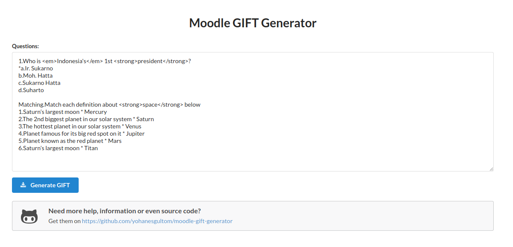

# Moodle GIFT generator

[Moodle](https://moodle.org/) question format (GIFT) generator. Currently only `multiple-choice` and `matching` type supported. Fully-rewritten in plain javascript (the PHP version is left in `_old` directory for reference).

**Live demo: http://moodlegift.gultom.id**



### Usage

Steps to generate GIFT file from plain text questions in the web app:

1. Paste/write questions in format following examples below
1. Click generate button. If there is no warning, file will automatically downloaded by your browser
1. If there is warning, fix your questions and click generate button again. Repeat until successful

Example of questions:

```
1.Who is <em>Indonesia's</em> 1st <strong>president</strong>?
*a.Ir. Sukarno
b.Moh. Hatta
c.Sukarno Hatta
d.Suharto

Matching.Match each definition about <strong>space</strong> below
1.Saturn’s largest moon * Mercury
2.The 2nd biggest planet in our solar system * Saturn
3.The hottest planet in our solar system * Venus
4.Planet famous for its big red spot on it * Jupiter
5.Planet known as the red planet * Mars
6.Saturn’s largest moon * Titan
```
### Production

1. Clone/download this repo
1. Copy/upload all files in `src/` to your web server

### Development 

With Docker:

1. Use latest node image (adjust the port `-p` if needed) `docker run -d -t -v $(pwd):/home/app -w /home/app -p 8080:8080 --name node-dev node:16-buster`
1. Connect to the container `docker exec -it node-dev bash`
1. Run test `npm test`
1. Run server `npm start`
1. Press `Ctrl+D` or `Cmd+D` to exit then run `docker stop node-dev && docker rm node-dev` to clean up the container

Without Docker:

1. Install Node.js >= 16.x 
1. Clone/download this repo
1. Enter local repo directory and install development dependencies `npm install`
1. Run test to make sure everything is fine `npm test`
1. Run using built-in web server `npm start`

### License

The MIT License (MIT)
